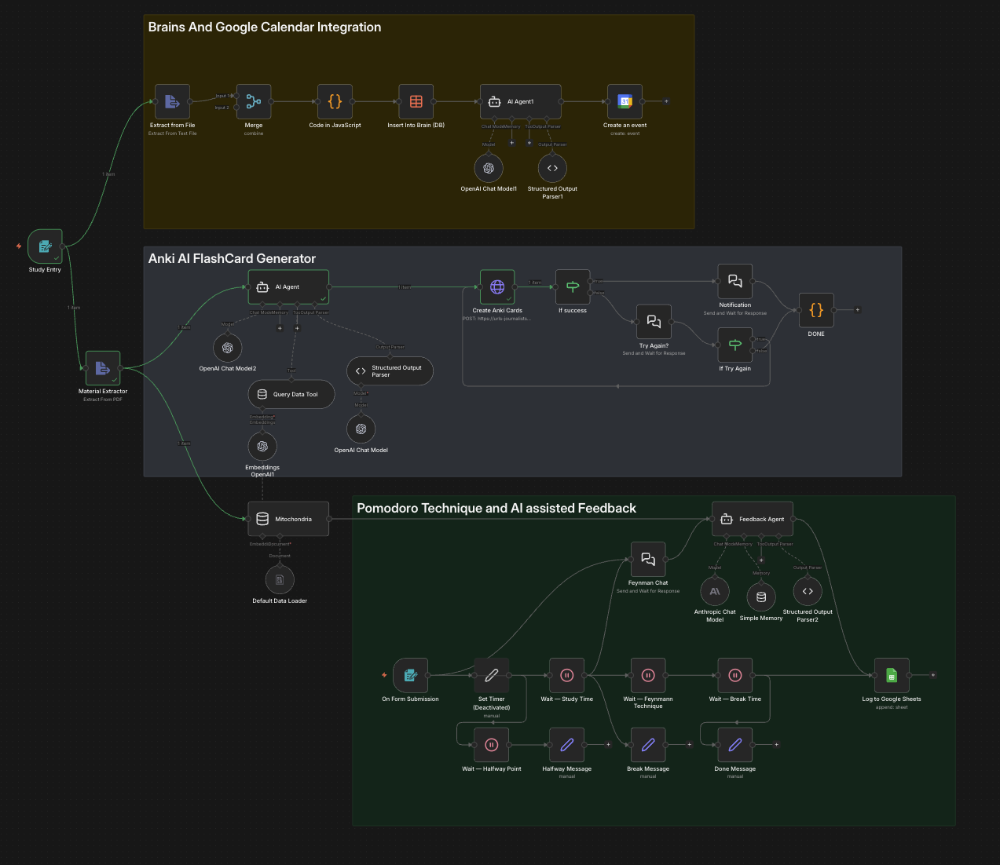
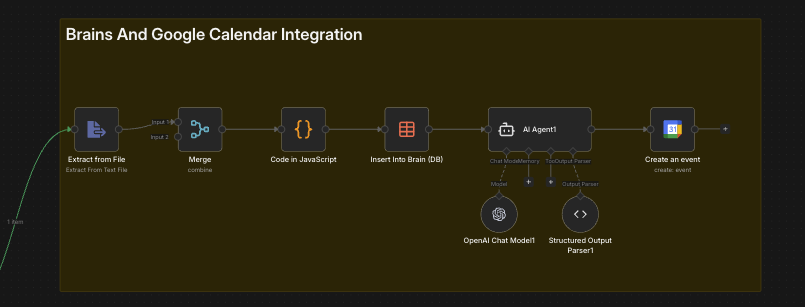
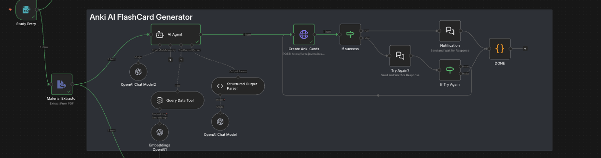
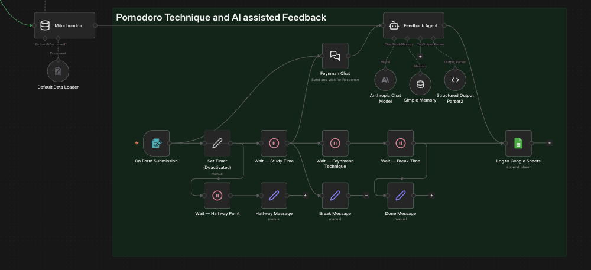

# StudyHack.AI

Authors: Alex Castillo, Thomas Phommarath, Zipporah Nellum, Joshwa Mputu

## Inspiration

Creating study material and a study system is hard. On top of feeling like your studying has been wasted due to bad study habits and techniques. We at StudyHack wanted to change this.

## What it does

StudyHack takes your course syllabus and course topics and builds a study guide and material that integrates into your calendar for easy access, saving students time for higher-impact tasks. The study guide focuses on implementing science-backed study practices along with analysis and feedback for your strengths and weaknesses. The created study material is created and imported into Anki to leverage on-the-go studying and its spaced repetition platform. This application learns from you so you can achieve your best results.

## How we built it

We worked up a game plan of features and split the work between our team members. We worked in our own workflows to later merge our n8n pipeline, integrated Google services along with a custom API for building flashcards in Anki. The API was created with FastAPI and locally hosted for demo interactions.



<!-- 

 -->


## Anki Flashcard Generator API and n8n Integration

A FastAPI service that creates Anki decks and Basic (Front/Back) flashcards via [AnkiConnect](https://git.sr.ht/~foosoft/anki-connect).

## Prerequisites

1. **Anki** desktop app installed and running
2. **AnkiConnect** add-on installed (Tools → Add-ons → Get Add-ons → code `2055492159`)
  - Anki Download Link (https://apps.ankiweb.net/)
  - The Anki desktop must be open on your device for the flashcard generator to work.
3. Docker (https://www.docker.com/)

## Setup n8n cloud hosted and FastAPI localhost Cloudflare tunneling

run the commands

```
uvicorn main:app --reload
```

```
cloudflared tunnel --url http://localhost:8000
```
grab the tunneling url and paste it into the url for http, create anki cards node, requests on n8n


## Setup (Docker)

```bash
docker compose up
```

```API http://0.0.0.0:8000/docs```
```n8n http://localhost:5678/```


### Aside If you cannot see the workflow
In the local n8n menu
1) Create a new workflow
2) Click on the horizontal 3 dots on the top right hand corner
3) Click import from file
4) Upload the Monolith-lynx-hack.json file from the repository

## Environment Variable Integration (TODO)

## Endpoints

### `GET /health`

Verify AnkiConnect is reachable.

### `POST /create-deck`

Create a deck and add flashcards.

**Request:**

```json
{
  "topic": "Python Basics",
  "cards": {
    "questions": [
      "What is a list?",
      "What is a dict?"
    ],
    "answers": [
      "An ordered, mutable collection of items",
      "A key-value mapping data structure"
    ],
    "tags": ["python", "basics"]
  }
}
```

**Response:**

```json
{
  "status": "success",
  "deck_id": 1234567890,
  "cards_created": 2,
  "note_ids": [1716968687679, 1716968687680],
  "errors": []
}
```

### Validation Rules

- `questions` and `answers` arrays **must** be the same length (returns 422 if mismatched)
- `topic` must not be empty
- At least one question/answer pair is required
- Duplicate cards within the same deck are skipped (reported in `errors`)

## Interactive Docs

Once running, visit `http://localhost:8000/docs` for Swagger UI.

## Example: curl

```bash
curl -X POST http://localhost:8000/create-deck \
  -H "Content-Type: application/json" \
  -d '{
    "topic": "AWS Solutions Architect",
    "cards": {
      "questions": ["What is an S3 bucket?", "What does IAM stand for?"],
      "answers": ["Object storage service", "Identity and Access Management"],
      "tags": ["aws", "cloud"]
    }
  }'
```

## n8n workflow

